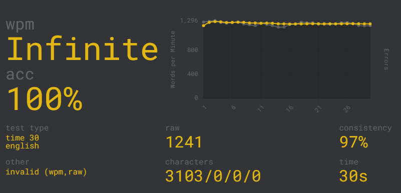

# Monkey Type

This web crawler will automaticaly type on <https://monkeytype.com>.



## Instructions

### Driver

The web crawler depends on the Selenium Python library, which requires a browser driver. I used Google Chrome, so I will need a Chrome driver. You can find the latest Chrome drivers [here]( https://chromedriver.chromium.org). Note that the driver and browser versions must be the same.

Make sure to put your driver in the "driver" folder.

### Installation

Make sure you have Selenium installed.

```python
pip install selenium # install selenium with pip
```

### Things To Note

You can adjust the delay to make typing slower or faster.

```python
delay = 0 # the delay between each letter typed
```

Type 'start' in the terminal to start typing.

Type 'quit' to exit the program.

Monkey Type has a bot detection system, so don't blame me when your account gets banned.
